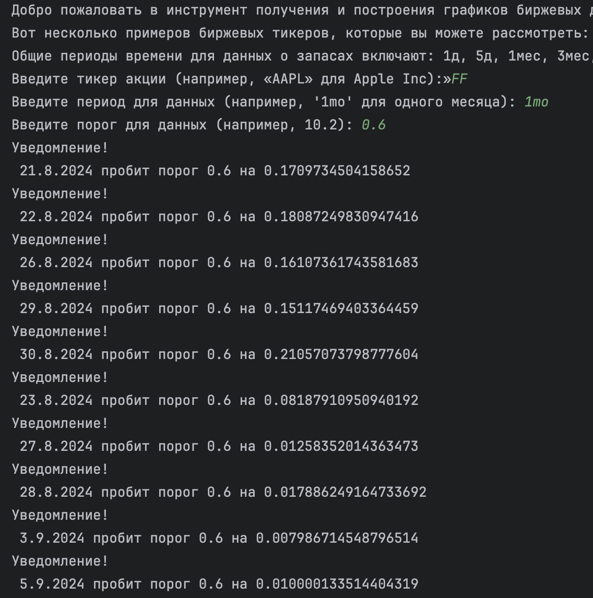

### Задача 1
_Вывод средней цены за период_

### Задача 2
_Уведомление о сильных колебаниях_

### Задача 3
_Экспорт данных в CSV_

### Задача 4
_Добавление дополнительных технических индикаторов_

### Задача 5
_Улучшенное управление временными периодами_

### Задача 6
_Добавление параметра для выбора стиля графика_

### Задача 6
_Расширенный анализ данных_

